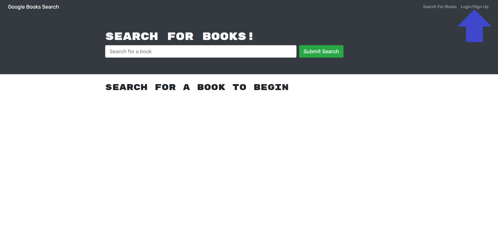
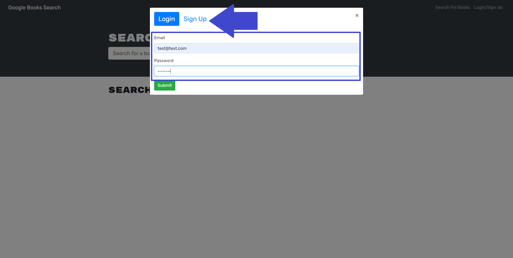
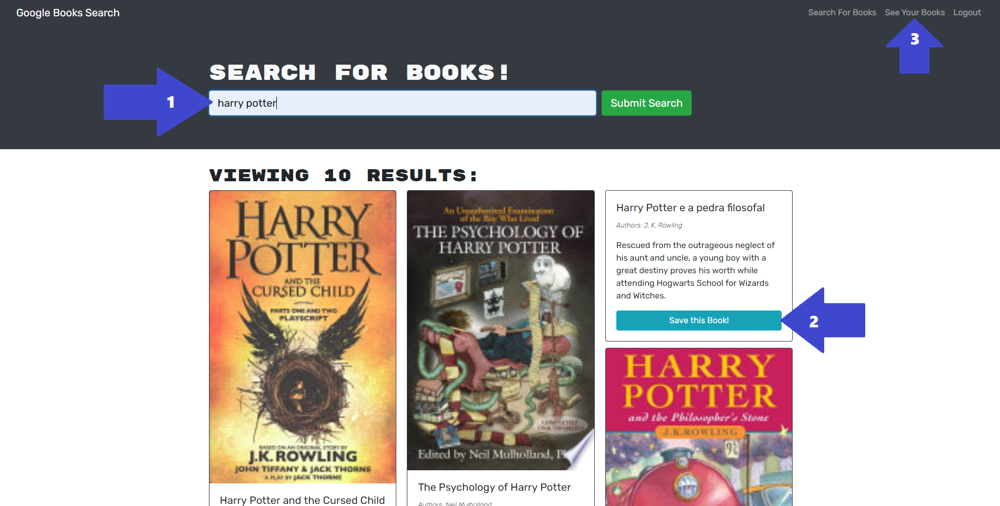
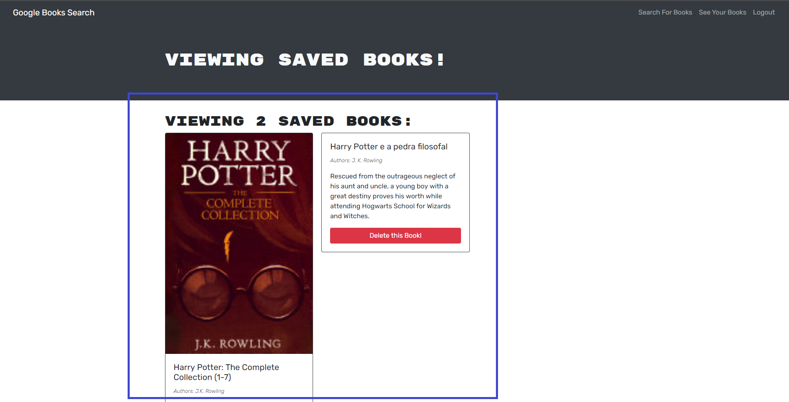

# Book-Search-Engine

## Description
This application is a fully functioning MERN Stack application. It uses GraphQL API with the Apollo Server.The application can be found in [Heroku](https://pacific-escarpment-08052.herokuapp.com/) but can also be cloned and run locally, see [Installation](#installation) and [Usage](#usage) for more details. This application was created for the avid reader, in order to give them the ability to search for new books and to keep an ongoing list of books to purchase.

## Table of Contents
- [Installation](#installation)
- [Usage](#usage)
- [Contributing](#contributing)
- [Questions](#questions)
- [License](##license)

## Demo

## Installation

How to install this application and getting started:

* Clone the repo to your local machine
* Open the integrated terminal
* Run `npm install` which will install any dependencies an all three package.json files
* Run `npm start` which will start the server GraphQL at http://localhost:3001/graphql
* Run `npm start` on the client folder and the client development build will compile and open

## Usage
You can find the deployed application by clicking on this link https://pacific-escarpment-08052.herokuapp.com/.

### Step 1
> **Note**: Not all available options and steps will be demonstrated here
* After the command has been invoked or if you visit the Heroku App you will see the landing page
* Click on the `Login/Sign Up` button on the upper right hand corner

### Step 2
* `Sign Up` if this is the first time using the app otherwise click `Login` and use your credentials.
* Click `Submit`

### Step 3
* Begin by searching for a book as shown by `Arrow #1`
* Look through the list of books and click on `Save this Book!` as shown by `Arrow #2` to add it to your list
* To see your list of saved book click on `See Your Books` as shown by `Arrow #3`
* The last image shows the Saved Books Page if you are logged in

> **Note**: Not all applications options are demonstrated or depicted here

## Contributing
There are many ways in which you can participate in this project, for example:

* Submit bugs and feature requests
* Review source code changes
* Review the documentation and make pull requests for anything from typos to additional and new content

## Questions
To find more information and the repository on this project please visit my [GitHub](https://github.com/israelmrios).

For any additional questions please email me [here](mailto:israelm.riosjr@gmail.com).

## License
Copyright (c) 2021 Israel M Rios.
Licensed under the [MIT License](LICENSE).